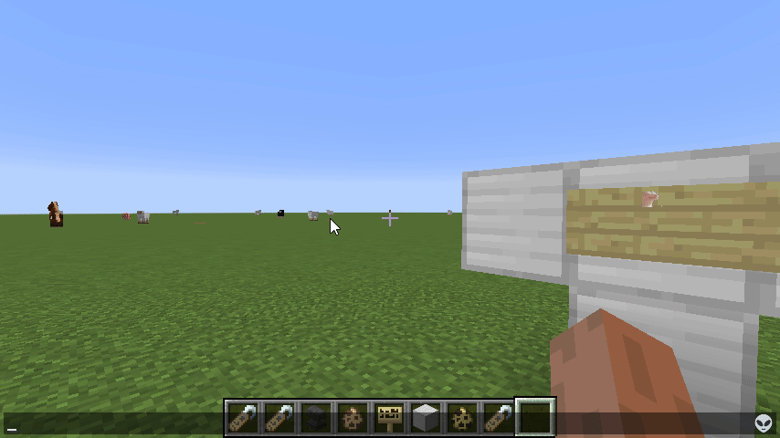

# Emojiful

[Emojiful](https://www.curseforge.com/minecraft/mc-mods/emojiful) adds in emoji to Minecraft allowing you to send emotion with ease. It supports animated emojis too! It has emoji autocomplete and emoji selection to easily search all the available emojis.

Emojiful is also set up in such a way so that if using a discord server mod, and someone types `:thinking:` into discord, Emojiful will render the correct emoji in Minecraft too.

Using specific triggers emojis will render instead of the usual text (things such as `:)`, `>:(`). For more advanced emoji there are things like `:rage:` and `:ok_hand:`.

If Emojiful is missing an emoji you believe should be present, you can add custom emojis using datapacks! You can use EmojiBot in this discord to easily transform discord emojis into datapacks!
